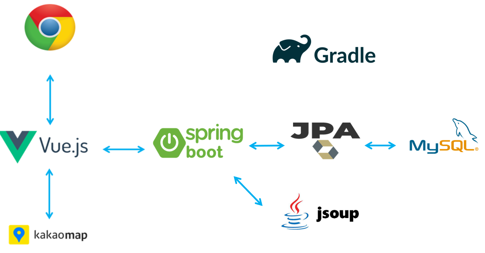
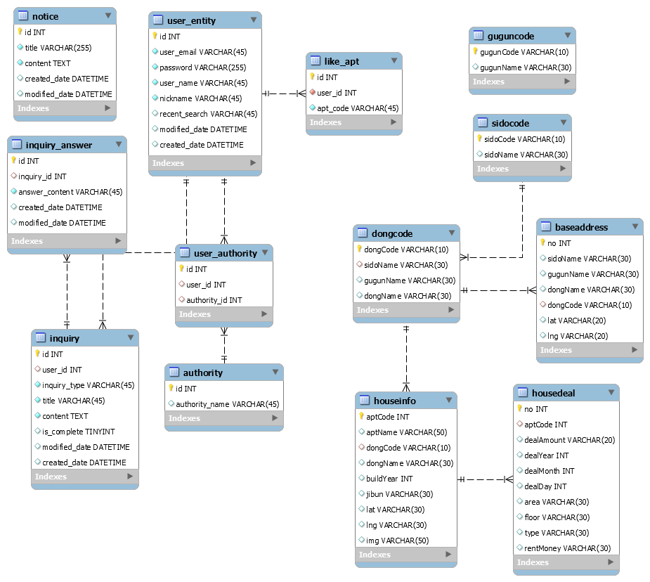

<div align="center">
  <br />
  
  <br />
  <h1>오늘의 부동산</h1>
  <br />
</div>

## 목차

1. [**웹 서비스 소개**](#1)
2. [**기술 스택**](#2)
3. [**주요 기능**](#3)
4. [**프로젝트 구성도**](#4)
5. [**데모 영상**](#5)
6. [**개발 팀 소개**](#6)
7. [**개발 기간**](#7)
8. [**실행 방법**](#8)

<br />

<div id="1"></div>

## 💁 웹 서비스 소개

[공공 데이터 포탈](https://www.data.go.kr/data/15057511/openapi.do)에서 제공하는 아파트 실거래가 데이터를 활용하여 사용자가 이사를 하고자 하는 동네에서의 아파트 매매가 정보 및 주변 편의 시설 정보를 제공하는 **부동산 서비스**

<br />

<div id="2"></div>

## 🛠 기술 스택

### **Front-end**

|  |  |  |  |
| :----------------------------------------------------------------------------------------------------------------------------: | :--------------------------------------------------------------------------------------------------------------------------: | :-----------------------------------------------------------------------------------------------------------------: | ------------------------------------------------------------------------------------------------------------------------------- |
|                                                             HTML5                                                              |                                                             CSS3                                                             |                                                        SCSS                                                         | JavaScript(ES6)                                                                                                                 |

|  |  |
| :-----------------------------------------------------------------------------------------------------------------------------: | :-----------------------------------------------------------------------------------------------: |
|                                                             Vue.js                                                              |                                               Vuex                                                |

### **Back-end**

|  |  |  |
| :--------------------------------------------------------------------------------------------------------------------------: | :-----------------------------------------------------------------------------------------------------------------------------------------------------------------------------------: | :-----------------------------------------------------------------------------------------------------------------------------: |
|                                                             Java                                                             |                                                                                         Jsoup                                                                                         |                                                           Spring boot                                                           |

|  |  |
| :-----------------------------------------------------------------------------------------------------------------------------------------: | :---------------------------------------------------------------------------------------------------------------------------------: |
|                                                                     JPA                                                                     |                                                               MyBatis                                                               |

|  |
| :----------------------------------------------------------------------------------------------------------------------------: |
|                                                             MySQL                                                              |

### **Version Control**

|  |  |
| :---------------------------------------------------------------------------------------------------------------: | :--------------------------------------------------------------------------------------------------------------------: |
|                                                        Git                                                        |                                                         GitHub                                                         |

<br />

<div id="3"></div>

## 💡 주요 기능

|                     기능                     |                                                                                            내용                                                                                             |
| :------------------------------------------: | :-----------------------------------------------------------------------------------------------------------------------------------------------------------------------------------------: |
|     지역별 아파트 매매 정보 제공 서비스      |                                      동 검색을 통한 아파트 매매 정보를 제공합니다.<br /> 시 · 구 · 동 옵션 선택을 통한 아파트 매매 정보를 제공합니다.                                       |
| 최저가 · 최고가 아파트 매매 정보 제공 서비스 |                                                           검색한 지역별 아파트 목록에서의 최저가 · 최고가 매매 정보를 제공합니다.                                                           |
|      선택한 아파트의 로드뷰 제공 서비스      |                                       선택한 아파트 주변의 카카오 로드뷰를 제공하여 사용자가 아파트 주변의 환경을 확인할 수 있는 서비스를 제공합니다.                                       |
|        주변 편의시설 정보 제공 서비스        |                                                              은행 · 마트 · 약국 · 주유소 · 카페 · 편의점 정보들을 제공합니다.                                                               |
|               추천 매물 서비스               |                                  랜덤으로 아파트 매물을 추천합니다. (로그인 전)<br />사용자의 최근 검색어를 바탕으로 아파트 매물을 추천합니다. (로그인 후)                                  |
|             1대1 문의하기 서비스             | 고객센터에 1대1 문의를 할 수 있는 서비스입니다. (수정 및 삭제가 가능합니다.)<br />관리자 아이디로 로그인 시 모든 사용자들의 1대1 문의를 확인할 수 있으며 답글을 남기거나 삭제가 가능합니다. |
|        오늘의 부동산 뉴스 제공 서비스        |                                                  실시간 네이버 부동산 뉴스 페이지 크롤링을 통해 당일 부동산 뉴스를 사용자에게 제공합니다.                                                   |
|             회원정보 수정 서비스             |                                                         사용자가 이름 및 닉네임을 변경할 수 있는 회원정보 수정 서비스를 제공합니다.                                                         |

<br />

<div id="4"></div>

## 📂 프로젝트 구성도

|                              아키텍처(Architecture)                              |
| :------------------------------------------------------------------------------: |
|  |

|                      개체-관계 모델(ERD)                       |
| :------------------------------------------------------------: |
|  |

<br />

<div id="5"></div>

## 🎥 데모 영상

|                     메인 페이지                      |
| :--------------------------------------------------: |
|  |

<br />

<div id="6"></div>

## 👪 개발 팀 소개

<table>
  <tr>
    <td align="center">
      <a href="https://github.com/JeongHwan-dev">
        
      </a>
    </td>
    <td align="center">
      <a href="https://github.com/alveloper">
        
      </a>
    </td>
  </tr>
  <tr>
    <td align="center">
      <a href="https://github.com/JeongHwan-dev">
        박정환<br />(Front-end)
      </a>
    </td>
    <td align="center">
      <a href="https://github.com/alveloper">
        진형준<br />(Back-end)
      </a>
    </td>
</table>

<br />

|  이름  |   역할    |                                                                                                                                                              개발 내용                                                                                                                                                               |
| :----: | :-------: | :----------------------------------------------------------------------------------------------------------------------------------------------------------------------------------------------------------------------------------------------------------------------------------------------------------------------------------: |
| 박정환 | Front-end | 지역별 아파트 매매 정보 검색 서비스 개발<br />아파트 상세 정보 제공 서비스 개발<br />최저가 · 최고가 정보 제공 서비스 개발<br />주변 편의시설 정보 제공 서비스 개발<br />추천 매물 서비스 개발<br />1대1 문의하기 서비스<br />오늘의 부동산 뉴스 제공 서비스 개발<br />로그인 및 회원가입 서비스 개발<br />회원정보 수정 서비스 개발 |
| 진형준 | Back-end  |                                                                                                                                                                 ...                                                                                                                                                                  |

<br />

<div id="7"></div>

## 📅 개발 기간

21.11.16 ~ 21.11.26 (11일)

<br />

<div id='8'></div>

## 💻 실행 방법

### client 실행

1. **원격 저장소 복제**

```bash
$ git clone https://github.com/today-real-estate/today-real-estate_front-end.git
```

2. **프로젝트 폴더로 이동**

```bash
$ cd today-real-estate_front-end
```

3. **필요한 node_modules 설치**

```bash
$ npm install
```

4. **개발 서버 실행**

```bash
$ npm run serve
```

<br />

### server 실행

1. **원격 저장소 복제**

```bash
$ git clone https://github.com/today-real-estate/today-real-estate_back-end.git
```

2. **프로젝트 폴더로 이동**

```bash
$ cd today-real-estate_back-end
```
